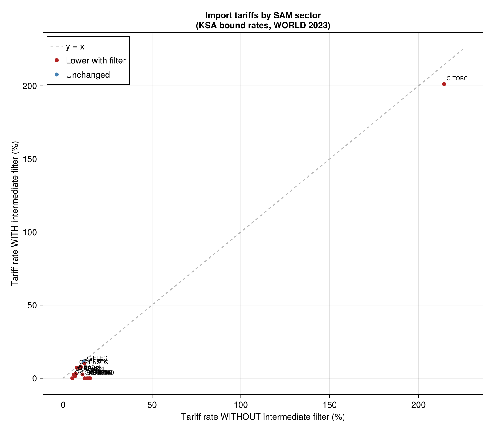
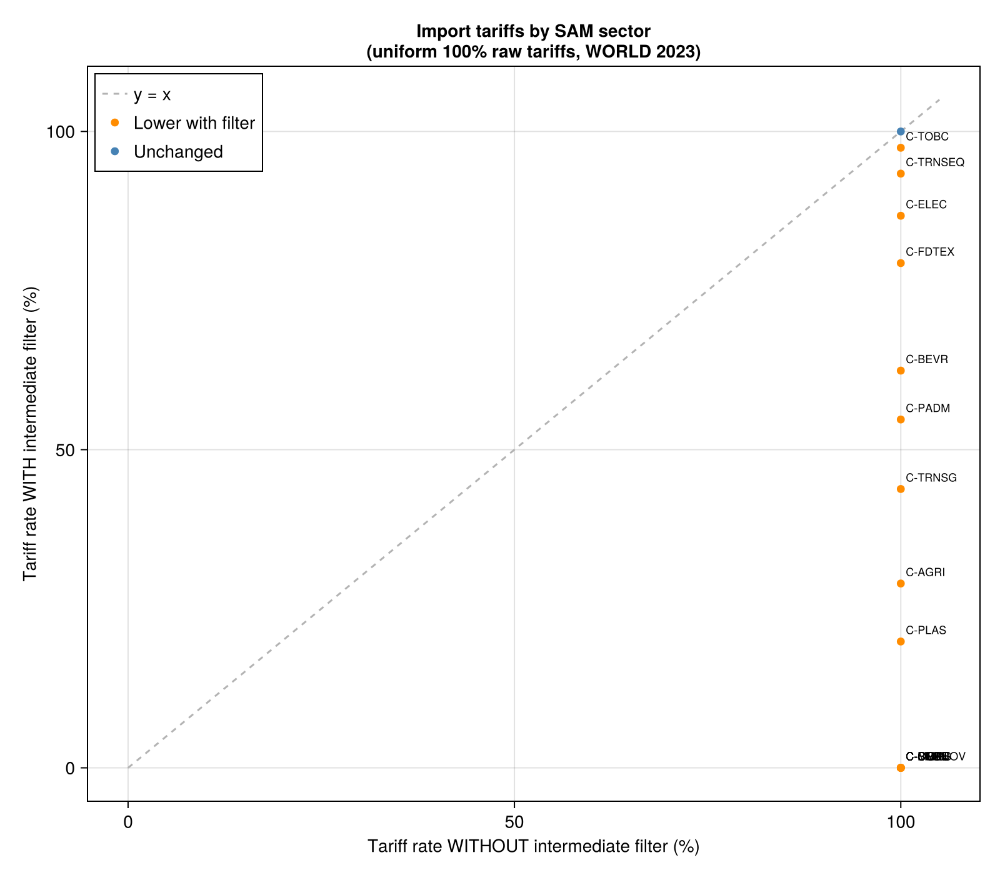

# TariffPipeline_hs6_to_sam

This tool takes Saudi Arabia's bilateral trade and tariff data — reported at the product level — and maps it into the sector structure used by a Social Accounting Matrix (SAM). The result is a set of trade values and average tariff rates organized by SAM sector, which can be directly fed into a SAM-based economic model.

---

## What this pipeline does (non-technical overview)

International trade statistics are reported using the **Harmonized System (HS)**, a global classification of products with over 5,000 six-digit codes. For example, code `090111` means "coffee, not roasted, not decaffeinated." A Social Accounting Matrix, on the other hand, organizes the economy into a much smaller number of broad sectors (e.g., Agriculture, Food Processing, Textiles).

To bridge this gap, the pipeline performs three translation steps:

1. **HS6 → CPC**: Each product code is mapped to the UN's Central Product Classification (CPC), an intermediate classification system. Some products map to multiple CPC codes, in which case trade is split equally.

2. **Intermediate goods filter**: Goods classified as *intermediate* under the UN's BEC/SNA system (i.e., inputs used in production rather than final consumption) are assigned a tariff of zero. This prevents intermediate inputs from distorting the effective tariff rates seen by each SAM sector.

3. **CPC → SAM**: CPC codes are matched to SAM sectors using a prefix-matching mapping, and trade values and tariffs are aggregated to the sector level using trade-weighted averages.

The output is a JSON file with imports and exports by SAM sector, along with trade-weighted average tariff rates. This can be used to calibrate trade flows and tariff shocks in a SAM-based computable general equilibrium (CGE) or input-output model.

### Data sources

| Data | Source |
|---|---|
| Trade flows (2019–2024) | Saudi General Authority for Statistics (GASTAT) |
| Bound tariff rates | WTO Consolidated Tariff Schedules (CTS) |
| HS6 → CPC concordance | UN Statistics Division (CPC 2.1 – HS 2017) |
| HS6 → SNA/BEC classification | UN Statistics Division (BEC Rev. 4, 2022) |
| CPC → SAM mapping | Project-specific, version-controlled JSON files |

### Known limitations

- The concordance is based on **HS2017**, but trade data includes codes from **HS2022** revisions. About 7.9% of total trade value (~$203B of $2.59T) cannot be mapped and is dropped.
- Tariff data uses **bound rates** (WTO ceiling), not applied rates, and applies uniformly across partners unless partner-specific rates are provided.
- The intermediate goods filter uses BEC4 codes — products that map to multiple BEC categories take the first matched SNA category.

---

## Technical reference

### Installation

```julia
using Pkg
Pkg.develop(path="/path/to/TariffPipeline_hs6_to_sam")
```

### Quick start

The main entry point is `hs6_to_sam_pipeline`, which handles validation, runs the full pipeline, and returns a `Dict`:

```julia
using TariffPipeline_hs6_to_sam

# Single country (uses default KSA bound tariffs)
result = hs6_to_sam_pipeline("CHINA", 2023)

# Multiple countries (aggregated)
result = hs6_to_sam_pipeline(["CHINA", "JAPAN"], 2023)

# All partners (WORLD)
result = hs6_to_sam_pipeline("WORLD", 2023)

# With custom tariff data
result = hs6_to_sam_pipeline("CHINA", 2023; tariff_path="data/my_tariffs.parquet")

# With a custom CPC→SAM mapping and write output to disk
result = hs6_to_sam_pipeline("CHINA", 2023;
    cpc_sam_path="assets/mappings/cpc_to_sam/SAMv3-A81-C83-L6-cmap.json",
    output_dir="output",
)

# Pass a pre-loaded DataFrame as tariffs
result = hs6_to_sam_pipeline("CHINA", 2023; tariff_path=my_tariff_df)
```

Or run from the terminal:

```bash
julia --project run.jl CHINA 2023
julia --project run.jl CHINA 2023 data/ksa_final_bound_tariffs.parquet
julia --project run.jl "CHINA,JAPAN" 2023
julia --project run.jl WORLD 2023
julia --project run.jl CHINA 2023 data/ksa_final_bound_tariffs.parquet assets/mappings/cpc_to_sam/SAMv3-A81-C83-L6-cmap.json
```

### Pipeline steps

```
INPUT 1: HS6 Trade        INPUT 2: HS6 Tariffs
(saudi_reporter.parquet)  (ksa_final_bound_tariffs.parquet)
        │                          │
        ▼                          ▼
   Filter by country          Filter by country
   and year                   (via join)
        │                          │
        └──────────┬───────────────┘
                   ▼
          MERGE 1:1 on (indicator, partner_name, product_code)
                   │
                   ▼
          NULLIFY tariffs for intermediate goods  ◄── INPUT 3: hs6_to_sna.json (BEC/SNA)
          • intermediate HS6 codes → tariff = 0.0
                   │
                   ▼
          AGGREGATE by HS6
          • trade_value = sum(value)
          • tariff = first non-missing (constant per HS6/indicator)
                   │
                   ▼
          MAP HS6 → CPC  ◄── INPUT 4: hs6_cpc_concordance.parquet
          • left join on product_code = hs6
          • equal split: trade_value / N when 1 HS6 → N CPCs
                   │
                   ▼
          AGGREGATE by CPC
          • trade_value = sum
          • tariff = trade-weighted average
                   │
                   ▼
          MAP CPC → SAM  ◄── INPUT 5: cpc_sam cmap JSON
          • longest prefix match
                   │
                   ▼
          AGGREGATE by SAM
          • trade_value = sum
          • tariff = trade-weighted average
                   │
                   ▼
              OUTPUT: SAM-level trade/tariffs (JSON)
```

### Inputs

#### 1. Trade data (`saudi_reporter.parquet`)

- **Source**: Saudi General Authority for Statistics (GASTAT), bilateral HS6-level trade data for KSA (2019–2024).
- **Raw file**: `deploy/ksa-hs-trade/Trade data (2019-24).csv`
- **Cleaning script**: `deploy/ksa-hs-trade/saudi_reporter.jl`
- **Deployed to**: AWS S3 → Glue → Athena via `deploy/ksa-hs-trade/deploy.sh`

| Column | Type | Description |
|---|---|---|
| `indicator` | String | `"Imports"` or `"Exports"` |
| `year` | Int | Trade year |
| `partner_name` | String | Country name, e.g. `"CHINA"` |
| `product_code` | String | 6-digit HS code |
| `value` | Float64 | Trade value in Saudi Riyals |

#### 2. Tariff data (`ksa_final_bound_tariffs.parquet`)

- **Source**: WTO Consolidated Tariff Schedules (CTS) — KSA final bound tariff rates, HS2012 classification.
- **Raw file**: `deploy/ksa-bound-tariffs/ksa_final_bound_tariffs.csv`
- **Cleaning script**: `deploy/ksa-bound-tariffs/ksa_final_bound_tariffs.jl`
- **Deployed to**: AWS S3 → Glue → Athena via `deploy/ksa-bound-tariffs/deploy.sh`

| Column | Type | Description |
|---|---|---|
| `indicator` | String | `"Imports"` or `"Exports"` |
| `partner_name` | String | `"WORLD"` or specific country |
| `product_code` | String | 6-digit HS code |
| `value` | Float64 | Tariff rate (%) |

If `partner_name = "WORLD"`, tariff rows are expanded to match every partner in the trade data.

#### 3. HS6 → SNA classification (`hs6_to_sna.json`)

- **Source**: UN BEC Rev. 4 (2022) concordance with HS2017, mapped to SNA use categories.
- **Building script**: `assets/mappings/hs_sitc_bec/hs6_to_bec.jl`
- **Output**: `assets/mappings/hs_sitc_bec/hs6_to_sna.json`

Maps SNA categories (`"Intermediate"`, `"Final consumption"`, `"Capital"`) to lists of HS6 codes. HS6 codes in `"Intermediate"` are assigned `tariff = 0.0` after the trade+tariff merge.

#### 4. HS6 → CPC concordance (`hs6_cpc_concordance.parquet`)

- **Source**: UN Statistics Division, CPC Ver. 2.1 – HS 2017 Correspondence Table.
- **Raw file**: `assets/mappings/hs6_to_cpc/CPC21-HS2017.csv`
- **Cleaning script**: `assets/mappings/hs6_to_cpc/clean_hs_cpc_concordance.jl`

| Column | Type | Description |
|---|---|---|
| `hs6` | String | 6-digit HS code (zero-padded) |
| `cpc` | String | 5-digit CPC 2.1 code (zero-padded) |

#### 5. CPC → SAM mapping (JSON)

A JSON object mapping SAM sector names to arrays of CPC prefixes:

```json
{
    "C-AGRI": ["011", "012", "013", ...],
    "C-FDTEX": ["021", "022", ...],
    ...
}
```

Matching uses longest-prefix: CPC `02131` matches prefix `"021"` → SAM `C-AGRI`.

### Exported functions

| Function | Description |
|---|---|
| `hs6_to_sam_pipeline(countries, year; tariff_path, cpc_sam_path, sna_path, output_dir)` | Validates inputs, runs full pipeline, returns output `Dict`. Accepts country string, vector, or `"WORLD"`. Tariff defaults to KSA bound tariffs; can be a path or DataFrame. Pass `sna_path=nothing` to disable intermediate filter. |
| `load_trade(path)` | Load trade parquet → DataFrame. Exported as a convenience for ad-hoc scripting. |

### Effect of the intermediate goods filter

The intermediate tariff filter has a material impact on the effective tariff rates that each SAM sector faces. The two plots below compare tariffs **with** vs **without** the filter applied, run against 2023 WORLD aggregated trade.

#### Plot 1 — Import tariffs (KSA bound rates)

Points below the dashed 45° line have a lower effective tariff with the filter on. 16 of 17 sectors with any tariff activity are reduced. The largest drops are in heavily intermediate sectors:

| Sector | Without filter | With filter | Drop |
|---|---|---|---|
| C-CRUD (Crude oil) | 15.00% | 0.00% | −15.00 pp |
| C-COAL | 15.00% | 0.00% | −15.00 pp |
| C-STON (Stone & minerals) | 14.12% | 0.00% | −14.12 pp |
| C-MORS (Motor vehicles) | 13.45% | 0.00% | −13.45 pp |
| C-BMET (Basic metals) | 12.01% | 0.00% | −12.01 pp |
| C-AGRI (Agriculture) | 10.92% | 2.68% | −8.24 pp |
| C-WATR (Water) | 11.50% | 11.50% | 0 (unchanged) |

C-WATR is the only sector not reduced — its product codes are classified entirely as final consumption or capital goods.



#### Plot 2 — Import tariffs (simulated: all raw rates = 100%)

To isolate how much the intermediate goods filter reduces each sector's effective tariff, all import HS6 codes are assigned a uniform 100% tariff. Without the filter, every sector would show exactly 100%. With the filter enabled, sectors containing intermediate HS6 codes see their trade-weighted tariff drop below 100% — the more intermediate trade value in a sector, the larger the drop.

Sectors whose entire import basket is intermediate goods (C-COAL, C-CRUD, C-OMIN, C-STON, C-BMET) collapse from 100% to exactly 0%. Mixed sectors like C-AGRI and C-PADM land between 0% and 100% depending on the intermediate share of their import value. Only C-WATR remains at the full 100%, indicating it is composed entirely of final or capital goods.



### Data cleaning notes

#### HS6 → CPC concordance

The source CSV must be read with `types=String`. When read as numeric, Julia parses HS codes as `Float64`, corrupting trailing zeros:

| Raw CSV | Read as Float64 | Correct |
|---|---|---|
| `0101.30` | → `"001013"` ✗ | `"010130"` ✓ |
| `0201.10` | → `"002011"` ✗ | `"020110"` ✓ |

2,749 of 5,843 codes were incorrect before this fix.

#### 1:Many HS6→CPC mappings

256 HS6 codes map to multiple CPCs. Trade value is split equally; tariff is kept as-is and handled by the weighted average at aggregation.

#### HS2017 / HS2022 mismatch

~378 HS6 codes in trade data (~7.9% of total value) have no concordance entry, mostly due to HS2022 revisions. These are dropped from the pipeline output.

### Project structure

```
TariffPipeline_hs6_to_sam/
├── Project.toml
├── Manifest.toml
├── run.jl                           # CLI entry point
├── src/
│   ├── TariffPipeline_hs6_to_sam.jl # Module definition + hs6_to_sam_pipeline
│   ├── loaders.jl                   # Data loading functions
│   ├── transforms.jl                # Transformation & aggregation functions
│   ├── validations.jl               # Input validation functions
│   ├── run_pipeline.jl              # Core pipeline (HS6 → CPC → SAM)
│   ├── query.jl                     # Athena SQL query runner
│   └── queries/                     # SQL files
├── assets/mappings/
│   ├── hs6_to_cpc/                  # HS6→CPC concordance
│   ├── cpc_to_sam/                  # CPC→SAM JSON mappings
│   └── hs_sitc_bec/                 # BEC/SNA classification files
├── data/                            # Input parquet files
├── output/                          # Pipeline JSON output
└── deploy/                          # AWS deployment scripts
```
